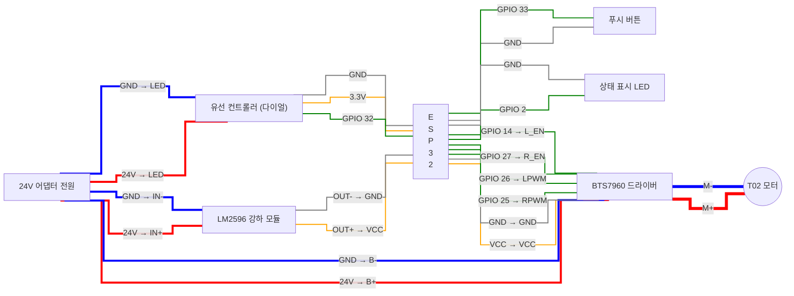

> [!NOTE]
> 🌐 Looking for the English version? [Click here!](README.md)

# T02 커스텀 스마트 컨트롤러 (ESP32) 🚀

이 프로젝트는 산업용 고출력 모터가 장착된 **T02 머신(120W, 24V 터보 기어 모터)**을 위해 극한까지 최적화된 **오픈소스 ESP32 커스텀 컨트롤러 펌웨어**입니다. 

거친 모터 진동과 소음을 완벽에 가깝게 잡아내며, 인기 있는 스마트폰 BLE 앱들과의 완벽한 무선 연동을 지원합니다.

---

## 🚨 법적 고지 및 경고 (조립 전 필독!)

> [!CAUTION]
> **고출력 전기 장치 주의!** 
> 이 프로젝트는 24V의 높은 전압과 120W급 산업용 고출력 모터를 다룹니다. 배선 실수나 합선 시 **화재, 재산 피해 또는 심각한 신체적 상해**를 초래할 수 있습니다.
> * **면책 조항:** 이 가이드와 소프트웨어는 '있는 그대로(AS IS)' 제공되며, 어떠한 형태의 보증도 하지 않습니다.
> * **책임 부인:** 코드 작성자는 이 기기를 조립하거나 사용함에 있어 발생하는 화재, 부상, 기기 고장 등 어떠한 피해에 대해서도 **절대 법적 책임을 지지 않습니다.** 모든 조립과 사용의 책임은 전적으로 본인에게 있습니다.
> * **비공식 프로젝트:** 본 프로젝트는 순수한 개인 DIY 오픈소스 프로젝트이며, Hismith, Lovense 등 특정 브랜드와 **어떠한 관련도, 후원도 받지 않는 비공식(Unofficial) 프로젝트**입니다. 본문 내 브랜드명은 단순 앱 호환성 테스트 컨텍스트로만 언급되었습니다.

---

## 🛠️ 필요 하드웨어 부품

* **마이크로컨트롤러:** ESP32 (예: ESP32-WROOM-32 등 블루투스 지원 보드)
* **모터 드라이버:** BTS7960 (43A 고출력 모터 드라이버)
* **스텝다운(강하) 모듈:** LM2596 (24V 전원을 ESP32용 5V로 낮춰줌)
* **조작 및 표시 부품:** 택트 스위치(모드 변경 버튼), 일반 LED 다이오드 (상태 표시용)
* **안전 및 배선 부품:** 16AWG 이상의 굵은 실리콘 전선 (24V 구동용), 절연 테이프 (쇼트 방지 마감용)

---

## ⚙️ 조립 전 필수 하드웨어 주의사항

> [!CAUTION]
> **🔥 1. 전선 굵기 (화재 위험):** 다이어그램에서 굵은 선(빨간색, 파란색)으로 표시된 **24V 전원 및 모터 구동 구간은 반드시 16AWG 이상의 두꺼운 전선**을 사용하세요. 얇은 점퍼선을 쓰면 전류(최대 10A)를 버티지 못하고 선이 녹아내려 화재가 발생합니다.
> 
> **⚡ 2. 5V 전압 강하 세팅 (기판 파괴 위험):** LM2596 강하 모듈을 ESP32에 연결하기 전, **반드시 테스터기로 출력 전압을 재면서 나사를 돌려 정확히 '5V'로 세팅**해야 합니다. 출고 상태(24V) 그대로 연결하면 ESP32 칩이 즉시 불타버립니다!
> 
> **🛡️ 3. 금속 케이스 쇼트 주의:** 부품들을 T02 컨트롤러 금속 박스 안에 넣을 때, 기판의 납땜 뒷면이 금속 케이스에 닿으면 즉시 합선(쇼트)되어 부품이 타버립니다. **반드시 절연 테이프로 기판을 감싸거나 캡톤 테이프 등을 붙여 금속면과 절대 닿지 않게 조치**한 후 조립하세요.

---

## ⚡ 배선도 (Wiring Diagram)

부품 기판에 적혀있는 글씨를 보고 아래 도면대로 똑같이 선만 이어주시면 됩니다!

### 🔌 5핀 항공 커넥터 배선 (T02 순정 리모컨 연결)

T02 순정 컨트롤러(내장 24V LED 포함)를 분리형 커넥터(GX16 등)로 만들려면 아래 원형 핀맵에 맞춰 납땜하세요. (커넥터 뒷면 납땜부 기준)

  <table style="text-align: center; border: none; font-size: 1.1em; width: 500px; margin: auto;">
    <tr>
      <td width="33%" style="border: none;"></td>
      <td width="34%" style="border: none; padding-bottom: 20px;"><b>[ 윗면 파인 홈 ] ⬇️</b></td>
      <td width="33%" style="border: none;"></td>
    </tr>
    <tr>
      <td style="border: none;"><h1>⑤</h1><b style="color:#e74c3c;">(24V LED +)</b></td>
      <td style="border: none;"></td>
      <td style="border: none;"><h1>①</h1><b style="color:#e67e22;">(3.3V 전원)</b></td>
    </tr>
    <tr>
      <td style="border: none;"> <h1>④</h1><b style="color:#34495e;">(24V LED -)</b> 어댑터 GND</td>
      <td style="border: none;"></td>
      <td style="border: none;"> <h1>②</h1><b style="color:#27ae60;">(GPIO 32)</b> 다이얼 신호</td>
    </tr>
    <tr>
      <td style="border: none;"></td>
      <td style="border: none;"> <h1>③</h1><b style="color:#000;">(ESP32 GND)</b> ESP32 마이너스</td>
      <td style="border: none;"></td>
    </tr>
  </table>

> [!WARNING]
> **합선 폭발 주의:** ⑤번 핀(24V)이 좁은 틈 사이로 ①번(3.3V)이나 ②번(GPIO) 핀과 닿으면 24V 전기가 ESP32로 직행하여 칩이 즉시 폭발합니다! 납땜 후 반드시 각 핀마다 수축 튜브를 씌워 절연하세요.

---

### 📌 핀 맵핑 요약표
| 출발점 | 도착점 |
| :--- | :--- |
| 어댑터 **24V+** | BTS7960 **B+** / LM2596 **IN+** |
| 어댑터 **24V- (GND)** | BTS7960 **B-** / LM2596 **IN-** |
| 유선 컨트롤러 **다이얼 신호선** | ESP32 **GPIO 32** |
| 유선 컨트롤러 **버튼 신호선** | ESP32 **GPIO 33** |
| ESP32 **GPIO 2** | 상태 표시 LED **(+)** |
| ESP32 **GND** | 상태 표시 LED **(-)** |
| ESP32 **GPIO 25** | BTS7960 **RPWM** |
| ESP32 **GPIO 26** | BTS7960 **LPWM** |
| ESP32 **GPIO 27** | BTS7960 **R_EN** |
| ESP32 **GPIO 14** | BTS7960 **L_EN** |

> [!IMPORTANT]
> **마이너스(GND) 통일 필수!** ESP32, LM2596, BTS7960 제어부의 모든 `GND(마이너스)` 핀은 서로 하나로 연결되어야 합니다. 단, 모터로 가는 아주 굵은 선인 `M-` 단자를 헷갈려서 기판 GND와 합선시키면 절대 안 됩니다!

## 💻 펌웨어 업로드 및 사용법

1. 아두이노 IDE에서 `T02_Custom_Controller.ino` 파일을 엽니다.
2. 라이브러리 매니저에서 **NimBLE-Arduino**를 검색하여 설치합니다.
3. 보드 매니저에서 ESP32를 선택 후 코드를 업로드합니다. (반드시 ESP32 Arduino Core v3.x 이상 버전 사용)
4. **작동 모드 안내:**
   - 컨트롤러의 푸시 버튼을 누르면 모드가 순차적으로 변경됩니다.
   - 🔵 **1번 깜빡임:** 수동 다이얼 모드
   - 🔵🔵 **2번 깜빡임:** 러벤스(Lovense) 앱 연동 모드
   - 🔵🔵🔵 **3번 깜빡임:** 히스미스(Hismith) 앱 연동 모드

## 📜 라이선스 (License)
이 프로젝트는 **MIT 라이선스**를 따릅니다. 누구나 자유롭게 사용, 수정, 배포할 수 있으나, 본문에 포함된 법적 면책 조항(Disclaimer)과 원작자 표시는 반드시 유지해야 합니다.
