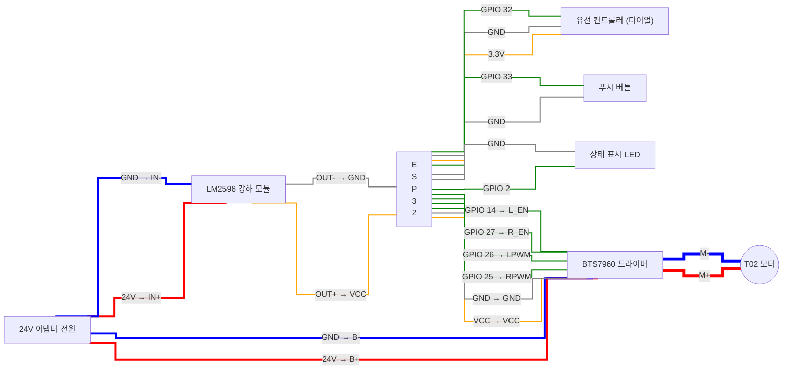

# 💡 한눈에 들어오는 ESP32 머신 완벽 배선도 (LED 미사용 버전)

이 버전은 유선 컨트롤러의 24V LED 조명을 사용하지 않거나 해당 선을 연결하지 않을 때 참고하는 깔끔한 버전입니다.

---

## 🎨 선 연결 색상표 (글로벌 표준)
배선 작업 시 선 색깔을 이렇게 통일해서 맞추면 헷갈릴 일이 없습니다.
* 🔴 **빨간색 굵은선**: `24V (또는 12V)` 메인 전원 (모터 구동용 강력한 전기)
* 🟠 **주황색 얇은선**: `5V / 3.3V` 로직 전원 (칩을 켜는 안전한 전기)
* 🔵 **파란색 굵은선**: `어댑터 GND 및 M-` (메인 마이너스 전원)
* ⚫ **검은색 얇은선**: `GND` (가장 중요한 제어용 마이너스 접지, 모두 하나로 이어져야 함)
* 🟢 **초록색 선**: `신호선` (속도를 조절하고 버튼을 클릭하는 데이터 선)
* 🔴 **빨간색 아주 굵은선**: `모터 전용선` (드라이버에서 모터로 가는 플러스 출력 선)

---

## ⚡ 핀 이름 기반 회로 연결도 (LED 선 제외)

---

## 📌 핀 맵핑 요약표
(위 도면과 일치합니다)

| 출발점 | 도착점 |
| :--- | :--- |
| 어댑터 **24V+** | BTS7960 **B+** |
| 어댑터 **24V-** | BTS7960 **B-** |
| 어댑터 **24V+** | LM2596 **IN+** |
| 어댑터 **24V-** | LM2596 **IN-** |
| | |
| 유선 컨트롤러 **다이얼 신호선** | ESP32 **GPIO 32** |
| 유선 컨트롤러 **버튼 신호선** | ESP32 **GPIO 33** |
| 유선 컨트롤러 **VCC** | ESP32 **3.3V** |
| 유선 컨트롤러 **GND** | ESP32 **GND** |
| | |
| ESP32 **GPIO 2** | 외부 상태 표시 LED **(+) 극** |
| ESP32 **GND** | 외부 상태 표시 LED **(-) 극** |
| | |
| ESP32 **GPIO 25** | BTS7960 **RPWM** |
| ESP32 **GPIO 26** | BTS7960 **LPWM** |
| ESP32 **GPIO 27** | BTS7960 **R_EN** |
| ESP32 **GPIO 14** | BTS7960 **L_EN** |
| ESP32 **VCC** | BTS7960 **VCC** |
| ESP32 **GND** | BTS7960 **GND** |
| | |
| BTS7960 **M+** | T02 Motor **+** |
| BTS7960 **M-** | T02 Motor **-** |

---

## 🚨 마지막 주의사항 3가지 (조립 전 필독!)
1. **절대 금지:** 24V 전원이 ESP32나 스텝다운 모듈 출력 부분에 닿으면 기판이 연기를 내며 즉시 터집니다. 
2. **모두 모여라:** 다이어그램에 그려진 `GND (마이너스)` 끼리는 **전부 다 하나의 선으로 통하게끔** 납땜하거나 묶어줘야 합니다. 이걸 안 하면 센서 값이 미친 듯이 튀거나 모터가 안 돕니다.
3. **M-는 GND가 아닙니다:** 모터 드라이버의 M- 단자는 오직 모터의 마이너스 핀으로만 가야 합니다. 배터리의 마이너스(GND)와 헷갈려서 합선시키면 절대 안 됩니다.
4. **전선 굵기 (화재 주의):** 다이어그램에서 굵게 칠해진 24V 전원선 및 모터 구동선은 **반드시 16AWG 이상의 두꺼운 전선**을 써야 합니다. 얇은 점퍼선을 쓰면 전류를 버티지 못하고 선이 녹아내리며 불이 납니다.
